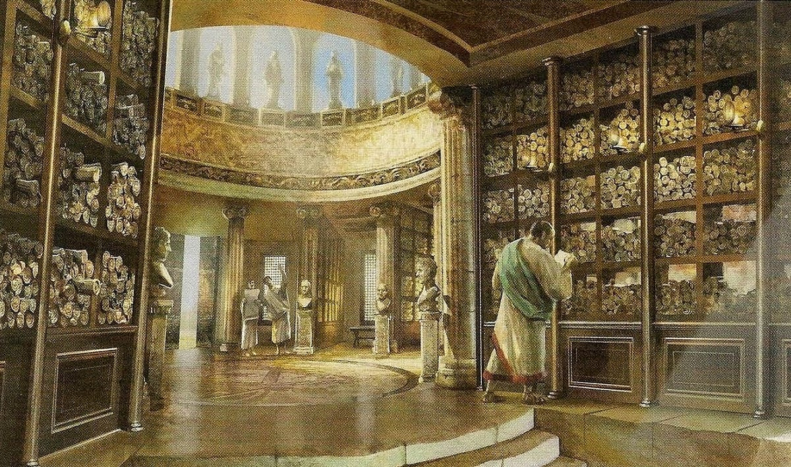

# Nuvibit Terraform Collection Wiki

Welcome to the Library of Alexandria!

This repository serves as a central knowledge hub for the `Nuvibit Terraform Collection` providing documentation, guides, and resources to help you successfully build your AWS cloud foundation.

## Getting Started

To explore the library, simply navigate to the wiki tab on top or click the button bellow.

    

## About the Library of Alexandria

The Library of Alexandria was a renowned center of knowledge in ancient Egypt. Founded during the reign of Ptolemy I in the 3rd century BCE, it aimed to collect, preserve, and disseminate knowledge from various civilizations. 
The library housed an extensive collection of scrolls, manuscripts, and texts from diverse fields such as science, philosophy, literature, and more.

> "The library was open to the world and we all owe something to its existence." - Carl Sagan

## Additional Resources

- [Wikipedia - Library of Alexandria](https://en.wikipedia.org/wiki/Library_of_Alexandria)
